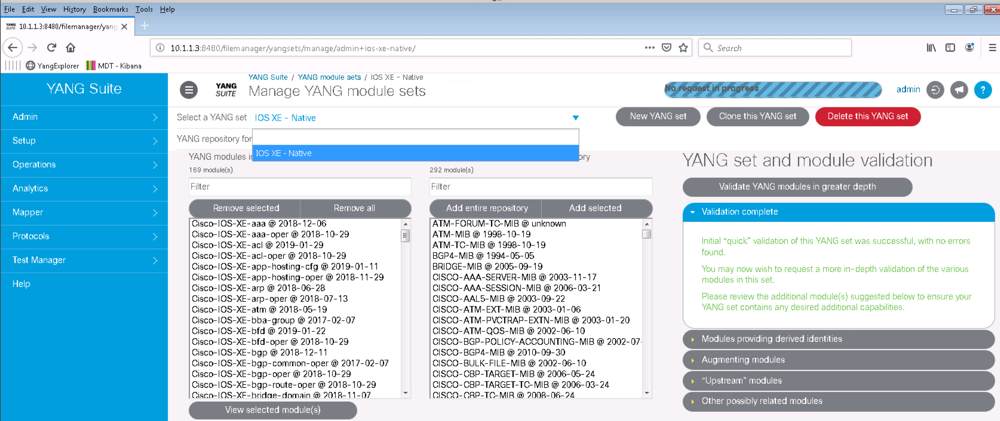
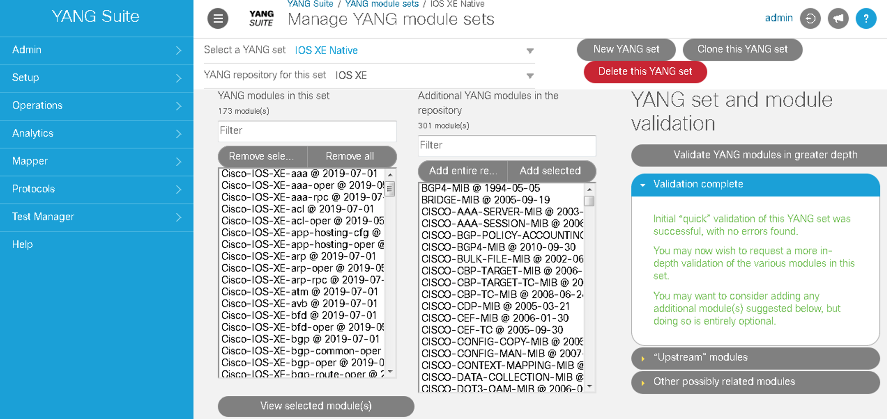
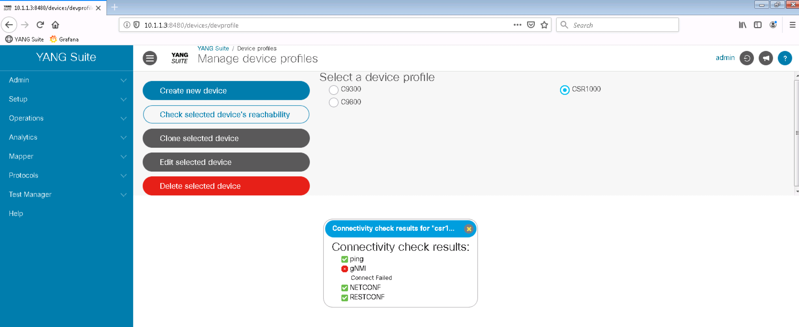
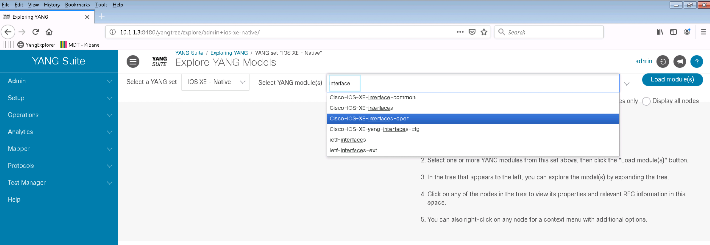
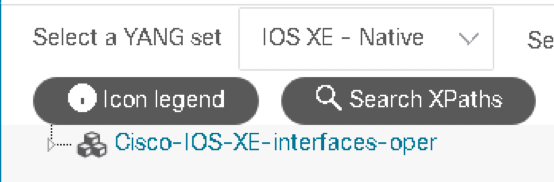
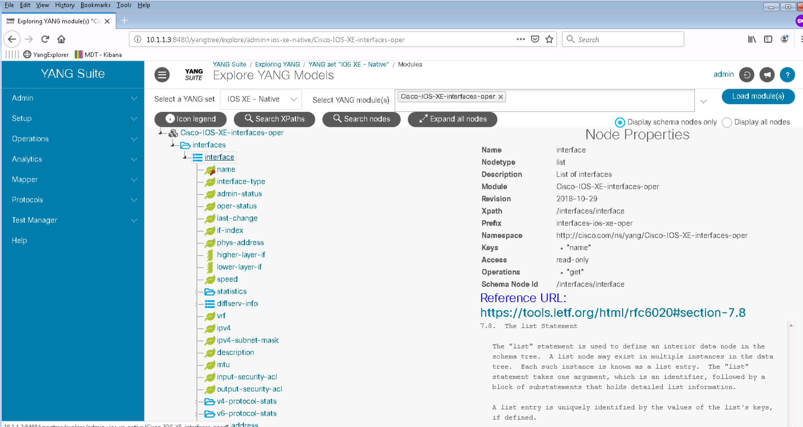
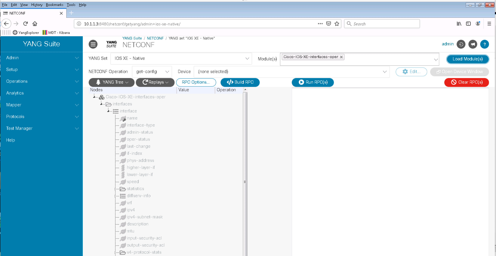
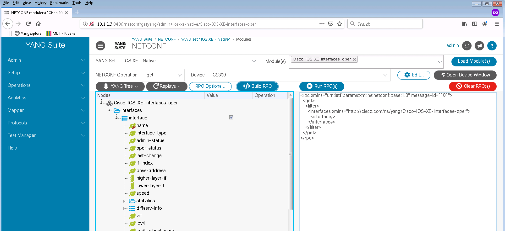

## [IOS XE Programmability Lab](https://github.com/jeremycohoe/cisco-ios-xe-programmability-lab)

## Module: NETCONF + YangSuite

## Module Topics:

Introduction to NETCONF/YANG

Enable NETCONF/YANG

YANGSuite

Conclusion

## Introduction to NETCONF/YANG

In this section we will look at YANG data models, why we need them, and how to find them. We will use a tool called YangSuite to find the data models we need, and we will write Python scripts using the models.

## Enable NETCONF/YANG

Before we start using YANG explorer to look at the data models on our switches, we need to run through a few steps to enable NETCONF, which is not on by default.

Open a SSH session to your C9300 switch and Verify AAA and NETCONF are already configured on the device.

```
C9300#sh run | sec aaa

aaa new-model
aaa authentication login default local
aaa authorization exec default local
aaa session-id common

C9300#sh run | sec vty

line vty 0 4
exec-timeout 0 0
transport input all
line vty 5 15
exec-timeout 0 0
transport input all

C9300#sh run | i netconf
netconf-yang
```

## YANGSuite

YANG Suite is a tool developed by Cisco to help you visualize YANG data models downloaded from a device, to test sending and receiving data to/from devices using YANG models, as well as a NETCONF RPC Builder Application to experiment with YANG Data Models. It is meant to replace YANG Explorer but while YANG Explorer is an Open Source tool, YANG Suite is currently available for Cisco Internal use only.

Open YANG Suite and read configuration data:

Step 1. Open a web browser and access YangSuite at <http://10.1.1.3:8480>

Step 2. Login using the provided credentials

Step 3. YANG Suite allows you to work with different YANG Modules repositories. This is very useful especially if working with different device releases at the same time. Click the **Setup** menu and then **YANG files and repositories**. Select **IOS XE** from the **Select a YANG module repository** drop down menu. A list of YANG Modules will appear:


These are all the YANG Modules supported on IOS XE. They have been directly downloaded from the Catalyst 9300 using the NETCONF protocol.

Setp 4. The YANG modules repository you can create subsets of modules called sets. Click in the **YANG module sets** under the **Setup** menu on the left pane.



Step 5. Now select **IOS XE - Native** from the Select a YANG set drop down
menu. All the IOS XE Native models are displayed in the box on the
left



YANG Suite automatically runs a validation check to make sure all the modules dependencies are met and provides an automatic remediation in case some dependencies are missing. In this case, all models and their dependencies have been preloaded into the tooling.

Step 6. Click on the **Setup** menu and then click on **Device profiles** on the left pane. It should display 3 device profiles on the right side:


Select CSR1000 profile and click on **Check selected device's reachability**. All checks should be OK except gNMI which may not yet been configured or enabled on the devices.



Repeat the same process for the other 2 devices to confirm they are reachable and their programmatic interfaces are up

Step 7. YANG Suite provides an intuitive way to navigate the YANG modules.

Note: Cisco supports OpenConfig and IETF YANG models as well as Cisco Native models. The native models, like the Cisco-IOS-XE- models, are required when standards do not support all aspects of Cisco features or functionality.

Click on the **Operations** menu and then **Explore YANG** on the left pane. Select **IOS XE - Native** from the **Select a YANG set** drop down menu.


Type interface in the Select YANG module(S) box and select the **Cisco-IOS-XE-interfaces-oper** module:



Click on the **Load module(s)** button and expand the **Cisco-IOS-XE-interfaces-oper** module clicking on the triangle on the left:


	
Examine the structure of the model and its content.

Two important pieces of YANG model metadata are the **XPath** and the **Prefix**. These fields are used with Model Driven Telemetry to retrieve information with. If a telemetry subscription were to be created based on the IOS XE Interfaces YANG data model, the Xpath of "/interfaces/interface" and "interfaces-ios-xe-oper" would be used to retrieve and publish information from those models.

Click on the **interface** list icon. On the right side you should see all the info related to interface list, including a reference to the public documentation on YANG lists:



Step 8.  YANGSuite allows you to interact with the devices using most of the programmatic interfaces: NETCONF, RESTCONF, gNMI, and gRPC. This step uses the NETCONF programmatic interface:

Click on the **Protocols** menu and then **NETCONF**. Select **IOS XE - Native** from the **YANG set** drop down menu. Type **interface** in **Module(s)** box, select the **Cisco-IOS-XE-interfaces-oper** module, click the **Load Modules(s)** button and expand the module tree to see the full tree listing.



YANG Suite automatically verifies which NETCONF operation are allowed for the given YANG Modules. All the IOS XE Native modules with names that end with "-oper" are Operational Data Modules. These modules support NETCONF GET operation. The module in the figure above is grayed out because the NETCONF Operation selected is edit-config instead.

Click on **get** in the **NETCONF Operation** pane and they shouldn't be grayed out anymore because get is allowed on the given module.

Select a device **C9300** from the **Device list**, click on the **Value** column for the "**interface**" row, and a check-box will appear. Click on **Build RPC button**. A NETCONF RPC should appear in the left pane:



Click on the **Run RPC(s)** button on the upper right of the RPC window. A new tab with the NETCONF RPC execution should open:


Examine the output. It includes the session details (10.1.1.5:830), the operation type (get) the RPC sent, the operation result code (OK) and finally the output received from the device with all the operational state of all device interfaces.

Step 9.  YANG modules allow filtering in order to get only what's really needed. Let's get a specific interface configuration using an IETF module.

Close the tab with the RPC output and then click on the **Clear Values and Operations under YANG Tree** and **Clear RPC(s)** buttons to reset all the values.


Select **IOS XE - IETF** module set, type **interface** in the **Module(s)** box, select the **IETF-interfaces** module, click the **Load Module(s)** button and expand the module by clicking the triangles to the left of **ietf-interfaces, interfaces,** and then **interface.**

Click on the **Value** column in the **name** row, type **Loopback0**, click on **Build RPC(s).**

Note: Be sure not to put a space between "Loopback" and "0"!

Check the RPC and you should see a Loopback0 filter:


Click on **Run RPC(S)**. This time you should see the Loopback interface configuration only.


Step 10. YANG Suite can be used to modify the device configuration as well.
    
    
Click on the **Clear Values and Operations** and **Clear RPCs** buttons to reset all the values.
    
Select **edit-config** from the NETCONF Operation list. Click on the **Value** column in the **name** row and type
**Loopback0**. Click on the **Value** column in the **description** row and type **configured by YANG Suite**. Click on the **Build RPC** and then **Run RPC(s)** button.


Verify the Loopback0 description using YANG Suite and the skills just learned.

## Conclusion

In this module the YANGSuite tooling was introduced and used to explore the NETCONF programmatic interfaces as well as to understand details of the associated YANG data models.
